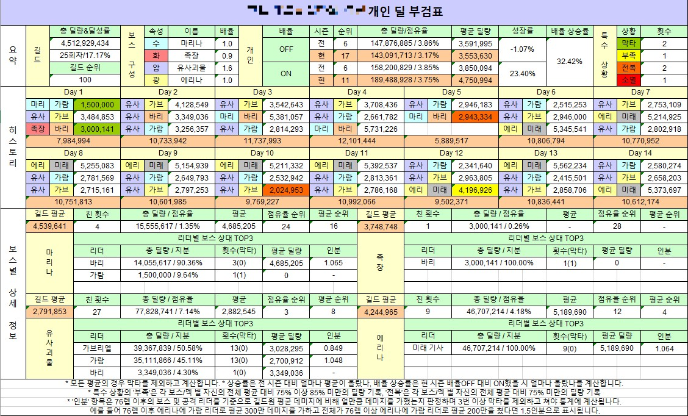
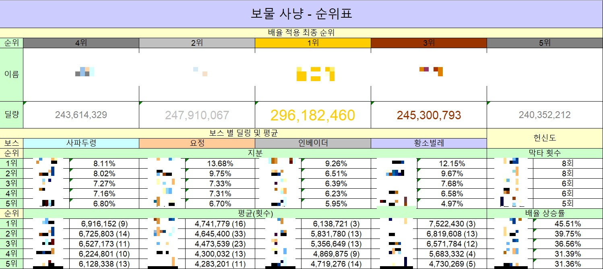

# 가테 길레 딜시트 - Android App

## 동기
- 현재 대다수가 엑셀을 통해 딜시트지를 기록 및 관리하고 있지만 엑셀은 컴퓨터를 켜서 입력을 해야 하며 DB에 따로 관리되지 않는 만큼 관리가 힘든 편.
- 이에 단순 작업을 줄이고 일일히 컴퓨터로 작업하는 것이 아닌 단순한 휴대폰 입력 만으로 간단히 시트를 작성하고 이것과 관련된 통계자료를 보여줄 수 있는 앱을 만들겠다고 생각하게 되어 앱을 개발

## 사용 방법
- 소스 코드 확인:

      git clone https://github.com/Factoriall/GuardianTalesGuildApp.git

  으로 clone 후 Android Studio로 켜서 확인

## 기능
### 길드원 관리  
  + 길드원 멤버 관리, 자신을 제외한 최대 29명의 인원 수용 가능
  + 길드 이름 및 길드원 참고사항 기록 가능
  + 길드원의 경우 현재 및 탈퇴 멤버로 나뉘며, 데이터 기록은 현재 길드원으로만 가능하고 현재 멤버의 경우 언제든 탈퇴시킬 수 있음
  + 탈퇴 멤버의 경우 복귀를 통해 다시 들여보낼 수도 있고 삭제도 가능.

### 현재 진행 중(또는 진행 예정) 길드 레이드 관리
  + 현재 레이드의 경우 시작 날짜 및 레이드 이름 입력, 시작 날짜의 경우 오늘로부터 2주 전~2주 후까지만 입력 가능
  + 입력 후 보스 정보 입력 가능. 보스의 정보는 이름, 사진, 속성, 배율로 나뉘어서 기록

### 현 레이드 기록 입력 프래그먼트
  + Spinner를 활용해서 닉네임 서칭 - 기본적으로 사전순으로 정렬되며 오늘 할당량을 채울 시 무조건 아래쪽으로 밀어넣음
  + 정보 삽입 시 Dialog를 띄워줌
      * Record 정보
        1. 보스 정보
        2. 레벨
        3. 리더 정보
        4. 데미지
        5. 막타 여부 입력
      * 레벨의 경우 첫 날에 한해 [한방컷] 버튼 활성화, 이 버튼을 누를 시 해당 레벨에 맞는 데미지 및 막타여부가 바로 입력됨
      * 리더 정보의 경우 즐겨찾기-기록기반 스위치 존재
        - 즐겨찾기는 자신이 자주 쓰는 영웅들을 최대 10명 등록해서 버튼 누르는 식으로 사용 가능, 1-3일차까지 기본 모드
        - 기록 기반은 4일차부터 기본 모드, 상대 보스 기준으로 사용한 리더를 DB에서 확인해서 나열
      * 기본적으로 레벨은 기록에 따라 **자동 조절**, 생성 버튼 클릭 시 Toast로 여러 상황 확인 가능
  + 데미지 카드의 경우 오른쪽으로 슬라이드하면 수정, 왼쪽으로 슬라이드하면 데이터를 삭제하는 ItemTouchHelper 구현

### 레이드의 전반적인 정보를 통계로 표현
  + 순위표: 필터를 기준으로 전체 순위 나열, 엑셀 변환 버튼을 통해 전반적인 기록을 추출 가능
  + 개인별 기록: 개인별 기록을 표현, 기본/상세 스위치로 나눠지며 기본은 전체 요약 및 히스토리 확인 가능, 상세로 보스별 기록 확인 가, 엑셀 변환 버튼을 통해 개인별 기록 추출 가능
  + 보스별 기록: 보스 상대로 전체 길드가 넣은 정보 확인 가능
  + 순위표 및 개인별 기록의 경우 Excel 파일로 추출 가능
  + 엑셀 결과
    * 개인

      

    * 순위표

      

## 사용한 오픈소스
- 통계 자료 시각화를 위한 MPAndroidChart: https://github.com/PhilJay/MPAndroidChart
- 엑셀 작성 POI: https://github.com/apache/poi
- TedPermission: https://github.com/ParkSangGwon/TedPermission
- 그 외 UI를 위한 NiceSpinner, ToggleSwitch, SwitchButton, CircleImageView 등등...
